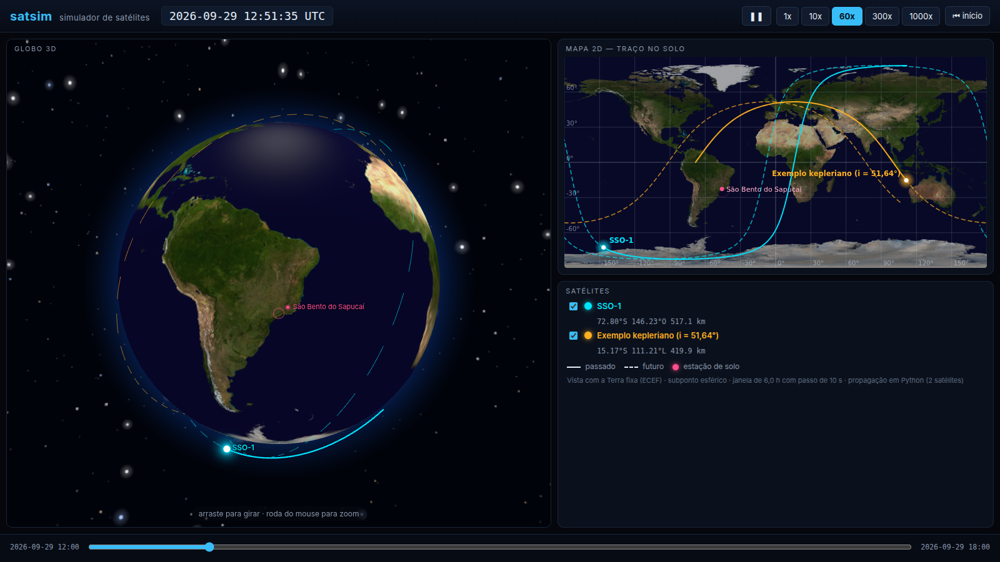

# satellite_constelation_simulation

**satsim** — simulador de posicionamento de satélites em Python, modular e fácil de estender
para mais satélites.

- **Fase 1 (semanas 1–4):** um satélite (a ISS), com posição e horários de visibilidade sobre
  São Bento do Sapucaí (SP).
- **Fase 2 (semana 5):** generalização para 6 satélites (constelação heliossíncrona 91/6, um
  plano).
- **Fase 3 (semanas 6–7, se houver tempo):** aplicação web com deploy e 18 satélites.

Todo propagador implementa `propagate(t) -> (r, v)` vetorizado; adicionar satélites é apenas
instanciar mais objetos. Unidades SI, ângulos em radianos internamente, tempo em UTC
(`datetime` com fuso).

## Instalação

Requer Python ≥ 3.11.

```bash
python -m venv .venv
source .venv/bin/activate        # Windows: .venv\Scripts\activate
pip install -e ".[dev]"
```

## Comandos

```bash
pytest               # testes
ruff check .         # lint
ruff format .        # formatação (use --check para só verificar)
```

## Estrutura

```
pyproject.toml               empacotamento, pytest e ruff
.github/workflows/ci.yml     CI: lint + testes em Python 3.11 e 3.12
docs/adr/                    decisões de arquitetura (ADR)
docs/creditos.md             créditos e licenças dos assets do viewer
src/satsim/                  código da biblioteca
src/satsim/app/              GUI: exportação da cena (Python) e viewer (static/)
scripts/build_demo.py        gera a demo visual demo/index.html
tests/                       testes (pytest)
```

## Demo visual



Globo 3D e mapa 2D com o traço no solo, na mesma tela e sincronizados. As órbitas são calculadas
em Python (propagador kepleriano) e o viewer só desenha.

**Gerar** (na raiz do repositório, com o venv ativo):

```bash
python scripts/build_demo.py      # cria demo/index.html (~2,5 MB, autocontido)
```

**Abrir:** dê dois cliques em `demo/index.html`, ou rode `xdg-open demo/index.html` no Linux
(`open` no macOS). Não precisa de servidor nem de internet: biblioteca, textura e cena vão
embutidas no arquivo. A pasta `demo/` não é versionada; gere de novo quando o código mudar.

**Adicionar um satélite:** acrescente uma linha à lista `SATELLITES` em
[`scripts/build_demo.py`](scripts/build_demo.py), por exemplo

```text
kepler_sat("kep2", "Terceiro (i = 30°)", "#b26bff", a_km=7200.0, e=0.01, i_deg=30.0, raan_deg=200.0, argp_deg=0.0, psi_deg=90.0),
```

e gere a demo de novo. O viewer lê quantos satélites houver na cena (testado com 18).

**Controles:**

| Controle | Ação |
|---|---|
| ▶ / ❚❚ (ou barra de espaço) | reproduzir / pausar |
| 1x · 10x · 60x · 300x · 1000x | velocidade da simulação |
| linha do tempo (embaixo) | arrastar para qualquer instante da janela de 6 h |
| ⏮ início | voltar ao início da janela |
| caixas na lista de satélites | mostrar / ocultar cada satélite |
| arrastar / roda do mouse no globo | girar / zoom |

No mapa, a linha cheia é o traço já percorrido e a tracejada é o futuro. São Bento do Sapucaí
aparece em rosa nos dois painéis. Nesta fase a vista mantém a Terra fixa (ECEF) e usa subponto
esférico; os créditos e licenças dos assets estão em [`docs/creditos.md`](docs/creditos.md).

## Golden tests

[`tests/golden/reference_values.py`](tests/golden/reference_values.py) reúne, num único arquivo
versionado, os números de referência dos PDFs teóricos (`docs/referencias/`: Sem3, decaimento
em LEO; Sem4, órbita heliossíncrona): constantes, órbita de projeto 91/6, Tabelas 1, 3 e 4 do
Sem4, taxas seculares de J2 e valores de arrasto do Sem3. Os testes de cada semana importam
esses valores em vez de repetir números soltos, por exemplo
`from golden.reference_values import DESIGN_ORBIT`.

[`tests/test_golden_consistency.py`](tests/test_golden_consistency.py) confere a coerência
interna dos números (por exemplo, `86400 / Tnod ≈ rev/dia`, `360° / N ≈ grade`, e o mesmo valor
igual em tabelas diferentes), para pegar erros de transcrição. Uma discrepância encontrada no
próprio PDF fica registrada como `xfail(strict=True)`, com a explicação no `reason`.

Para adicionar um valor:

1. coloque-o no grupo certo (ou crie um grupo novo, como `@dataclass(frozen=True)`), exatamente
   como aparece no documento, com o sufixo da unidade no nome (`h_km`, `i_deg`, `tnod_s`);
2. cite a fonte num comentário (documento, seção, tabela ou equação);
3. se o número puder ser deduzido de outros, acrescente um teste de consistência.

## Roadmap

| Semana | Entrega |
|---|---|
| 1 | Fundação e núcleo kepleriano: CI, ADR, constantes, elementos ↔ estado, propagador kepleriano, tempo (JD/GMST), golden tests |
| 2 | Perturbação J2 (elementos médios), quadros ECI/ECEF, geodésia e projeto de órbita |
| 3 | Propagação numérica (Cowell, arrasto) e validação contra SGP4/TLE da ISS |
| 4 | Sol, observador e visibilidade da ISS sobre São Bento do Sapucaí |
| 5 | Constelação heliossíncrona de 6 satélites (91/6, um plano) e cobertura |
| 6 | Aplicação web e deploy |
| 7 | Extensão para 18 satélites e acabamento (se houver tempo) |
